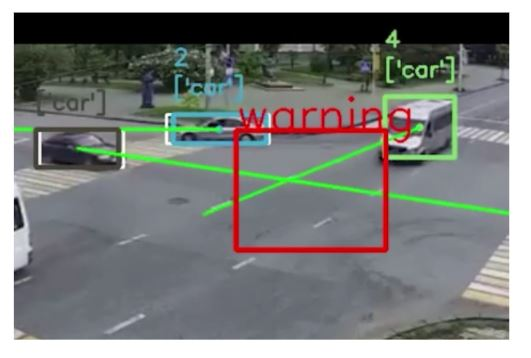

# YOLOv3 + Deep_SORT Vehicle Speed Estimation Tracker

.gif)

* __demo Video__: https://youtu.be/Dn9S8p49dqE

## team member
:runner: Choi sanghyun
:runner: Kim sungjo
:runner: Park meenhee


## dependencies
* OpenCV
* sklean
* pillow
* numpy 1.15.0
* tensorflow-gpu 1.13.1
* CUDA 10.0
***

It uses:

* __Detection__: [YOLOv3](https://github.com/yehengchen/ObjectDetection/tree/master/OneStage/yolo/yolov3)

* __Tracking__: [Deep_SORT](https://github.com/nwojke/deep_sort)

* __->__:[object detection and tracking (python)](https://github.com/yehengchen/Object-Detection-and-Tracking/tree/master/OneStage/yolo/deep_sort_yolov3)

## Quick Start

__0.Requirements__

    pip install -r requirements.txt
    
__1. Download the code to your computer.__
    
    git clone https://github.com/yehengchen/Object-Detection-and-Tracking.git
    
__2. Download [[yolov3.weights]](https://pjreddie.com/media/files/yolov3.weights)__ and place it in `deep_sort_yolov3/model_data/`


__3. Convert the Darknet YOLO model to a Keras model:__
```
$ python convert.py model_data/yolov3.cfg model_data/yolov3.weights model_data/yolo.h5
``` 
__4. Run the YOLO_DEEP_SORT:__

```
$ python main.py -c [CLASS NAME] -i [INPUT VIDEO PATH]

$ python main.py -c person -i ./test_video/testvideo.avi
```

## Citation

### YOLOv3 :

    @article{yolov3,
    title={YOLOv3: An Incremental Improvement},
    author={Redmon, Joseph and Farhadi, Ali},
    journal = {arXiv},
    year={2018}
    }

### Deep_SORT :

    @inproceedings{Wojke2017simple,
    title={Simple Online and Realtime Tracking with a Deep Association Metric},
    author={Wojke, Nicolai and Bewley, Alex and Paulus, Dietrich},
    booktitle={2017 IEEE International Conference on Image Processing (ICIP)},
    year={2017},
    pages={3645--3649},
    organization={IEEE},
    doi={10.1109/ICIP.2017.8296962}
    }

    @inproceedings{Wojke2018deep,
    title={Deep Cosine Metric Learning for Person Re-identification},
    author={Wojke, Nicolai and Bewley, Alex},
    booktitle={2018 IEEE Winter Conference on Applications of Computer Vision (WACV)},
    year={2018},
    pages={748--756},
    organization={IEEE},
    doi={10.1109/WACV.2018.00087}
    }
    
## Reference
#### Github:deep_sort@[Nicolai Wojke nwojke](https://github.com/nwojke/deep_sort)
#### Github:deep_sort_yolov3@[Qidian213 ](https://github.com/Qidian213/deep_sort_yolov3)
#### Github:Object-Detection-and-Tracking@[yehengchen](https://github.com/yehengchen/Object-Detection-and-Tracking)


